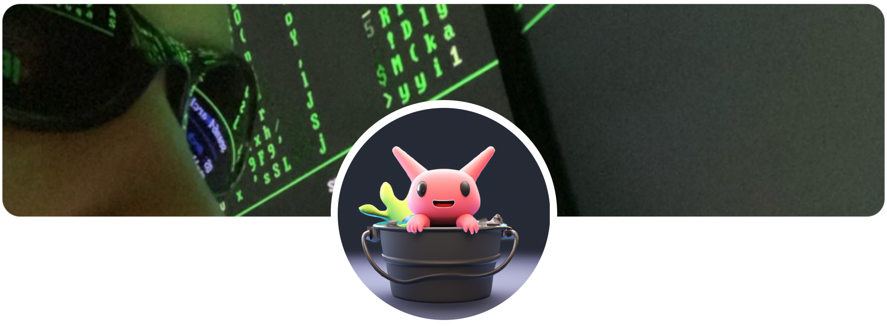

## 👨‍💻 About Me  

- 🥐 **French Developer**  
- 🎓 **Computer Science Student**  
- 🌍 **Explorer** – I’ve traveled the world and love discovering new cultures  
- 🚀 Passionate about **open source, low-level programming, IoT, and privacy focused software** 

## 🛠️ Technologies I Use  

### **Programming Languages**  
- **Compiled**: Rust, C, C++  
- **Interpreted**: JavaScript (NodeJS), Python  
- **Databases**: SQL, MongoDB  

### **Frontend & Frameworks**  
- Vue.js
- TailwindCSS

### **Hardware & Microcontrollers**  
- Digispark  
- ESP32  
- Arduino Uno  
- Raspberry Pi  

### **Operating Systems**  
- **Linux**: Arch Linux (btw)  

### **Text Editors**  
- VS Code  
- Neovim

## 💌 Contacts
- **Discord** : (same as my github username)
- **Mail** : haksolot@tutamail.com
- [PGP KEY](https://github.com/haksolot.gpg)
